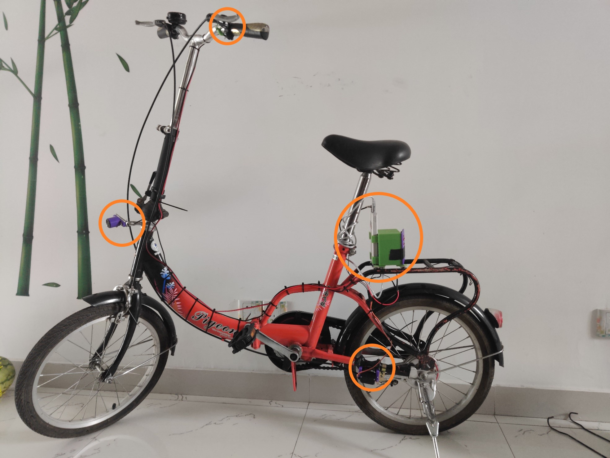
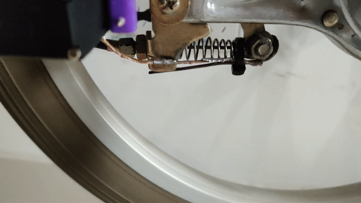

# Bicycle Active Safety System
:bike:A set of devices for danger detection and auto-reaction. 

Group project for "Engineering Practice"(ME210) in SJTU.

### Overview

#### The whole system on the bicycle

#### Device model

Ultrasonic sensor: jsn-sr04t-2.0

Steering engine: MG996R

#### Steering engine

work by pulling the brake cable

#### Other devices

    

### The project

[Poster](files/Poster.pdf)

[Final presentation](files/Final presentation.pdf)

### Team members:

Yijie Hong, Kangzhe Hu, Weihang Shen, and Yazhou Tang([@ADSWT518](https://github.com/ADSWT518)).
